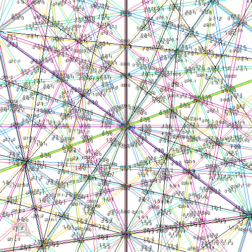
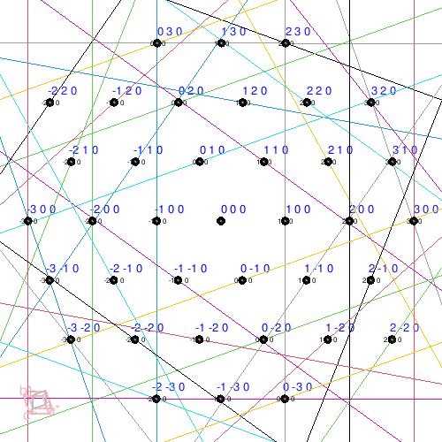
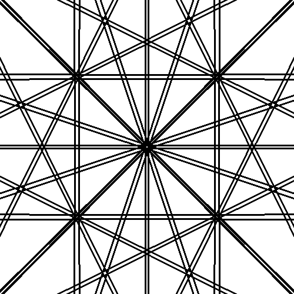
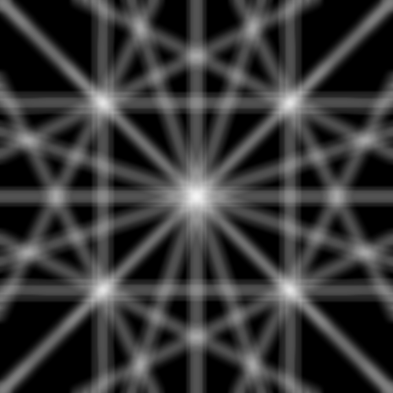
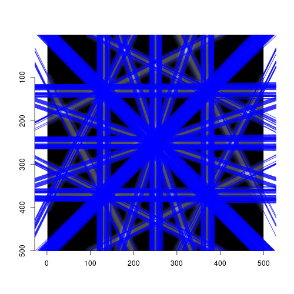
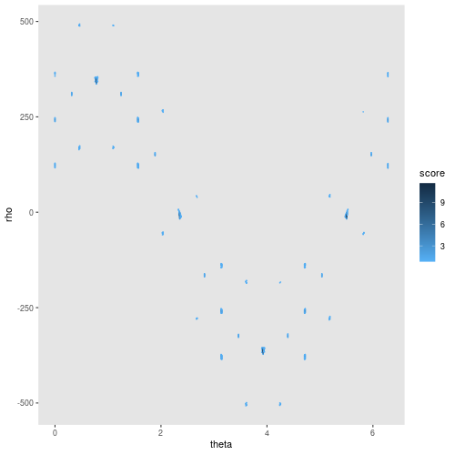
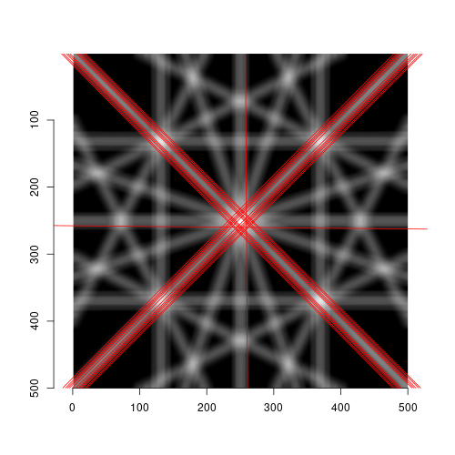
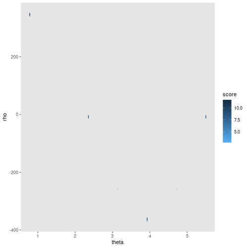

<!-- ------------------------------------------------------------ -->

```{r setup, include=FALSE}
library(knitr)
## opts_knit$set(global.par = TRUE) #
## par(mar=c(2,2,2,2))
library(rgl)
library(rgl.cry)
options(rgl.useNULL = TRUE) # suppress window display
setupKnitr(autoprint = FALSE) # for settings to override mouse callback
opts_chunk$set(
  echo = FALSE, error = FALSE, warning = FALSE, message = FALSE,
  fig.path = "images/"
)
## opts_chunk$set(cache=TRUE)
knit_hooks$set(webgl = hook_webgl)
setupKnitr(autoprint = FALSE) # for settings to override mouse callback
```

```{css, echo=FALSE}
div.myfig1 {
  margin: 3% 3%;
  display: flex;
  flex-wrap: wrap;
  justify-content: center;
}
div.mycap1 {
  width: 100%;
  display: flex;
  justify-content: center;
}
```


<!-- ------------------------------------------------------------ -->
## Kikuchi line drawing

I'm considering implementing Kikuchi line drawing for my studies at <a href="https://github.com/SaitouToshihide/rgl.cry/tree/DiffractionCone">https://github.com/SaitouToshihide/rgl.cry/tree/DiffractionCone</a>.

```{r, eval=FALSE, echo=TRUE}
dp_demo(system.file("cubic_i.cif", package = "rgl.cry"), zoom = 0.03, res = 1.3)
##rgl::snapshot3d("cubic_i_01.png", fmt="png", width=500, height=500, webshot = FALSE)
dp_demo(system.file("cubic_i.cif", package = "rgl.cry"), zoom = 0.0005, res = 1.3)
##rgl::snapshot3d("cubic_i_02.png", fmt="png", width=500, height=500, webshot = FALSE)
```
<div class="myfig1">
<div style="width: 35%; height: 35%;">
![Kikuchi lines of BCC structure along the [0 0 1] axis.](./images/cubic_i_01.png){width=100%}
</div>
<div style="width: 15%;"></div>
<div style="width: 35%; height: 35%;">
{width=100%}
</div>
<div class="mycap1">Images while debugging.</div>
</div>

#### Installation
```{r, eval=FALSE, echo=TRUE}
library(devtools)

install_github("SaitouToshihide/rgl.cry", ref="5e63cad")
```

#### Usage.
Run ``dp_demo()``.
```{r, eval=FALSE, echo=TRUE}
dp_demo() # default CIF data are loaded.
```
Let's see another crystal system.
```{r, eval=FALSE, echo=TRUE}
dp_demo(system.file("triclinic_p.cif", package = "rgl.cry"), zoom = 0.03, res = 2.0)
##rgl::snapshot3d("triclinic_p_001_01.png", fmt="png", width=500, height=500, webshot = FALSE)
dp_demo(system.file("triclinic_p.cif", package = "rgl.cry"), zoom = 0.0003, res = 2.0)
##rgl::snapshot3d("triclinic_p_001_02.png", fmt="png", width=500, height=500, webshot = FALSE)
```
<div class="myfig1">
<div style="width: 35%; height: 35%;">
{width=100%}
</div>
<div style="width: 15%;"></div>
<div style="width: 35%; height: 35%;">
{width=100%}
</div>
<div class="mycap1">Triclinic crystal.</div>
</div>
In this case, even in a triclinic lattice, diffraction spots such as (1 1 0) are visible. This is because the corresponding [1 1 0] vector in reciprocal space remains parallel to the xy-plane, even if the real-space [1 1 0] vector is inclined relative to the xy-plane.
We should not focus on imaging the vector denoted by Miller indices in real space. Instead, we should consider the repetition of planes and their normal direction or alternatively, image a vector in reciprocal space denoted by Miller indices.
Let's see.
```{r, eval=FALSE, echo=TRUE}
cry_demo()
align("90 0")
align("0 50") #

lCIF <- rgl.cry:::pkg$inst[[nrow(rgl.cry:::pkg$inst), "lCIF"]]
a <- lCIF$HEADER$CELL$A$VAL
b <- lCIF$HEADER$CELL$B$VAL
c <- lCIF$HEADER$CELL$C$VAL
aa <- lCIF$HEADER$CELL$ALPHA$VAL # degree
bb <- lCIF$HEADER$CELL$BETA$VAL
cc <- lCIF$HEADER$CELL$GAMMA$VAL
mat02 <- cry::xtal_mat02(a, b, c, aa, bb, cc)

vertices <- rbind(c(1,0,0), c(1,0,1), c(0,1,1), c(0,1,0))
vertices <- t(apply(vertices, 1, function(v) v %*% mat02))
combinations <- c(1,2,3,1, 1,4,3,1)
rgl::shade3d(rgl::mesh3d(vertices, quads = combinations), col = "blue", alpha = 0.9)

vertices <- rbind(c(1,0,0), c(1,0,1), c(0,1,1), c(0,1,0))
vertices <- t(apply(vertices, 1, function(v) v + c(1, 1, 0)))
vertices <- t(apply(vertices, 1, function(v) v %*% mat02))
rgl::shade3d(rgl::mesh3d(vertices, quads = combinations), col = "green", alpha = 0.9)
```
This is the side view of the image looking down along with c-axis indicated above as dp pattern.
We can observe that the direction [1 1 0] inclined in real space.
However, as the repetition of planes, this lies parallel to the xy-plane.

<span style="color:#d14">IMPORTANT:  Adding 3D graphics objects is made easy and flexible within R using the rgl and cry packages.</span>
<div class="myfig1">
```{r}
null <- cry_demo(system.file("triclinic_p.cif", package = "rgl.cry"))
align("90 0")
align("0 55.27") #
rgl::par3d(zoom=1.0)

lCIF <- rgl.cry:::pkg$inst[[nrow(rgl.cry:::pkg$inst), "lCIF"]]
a <- lCIF$HEADER$CELL$A$VAL
b <- lCIF$HEADER$CELL$B$VAL
c <- lCIF$HEADER$CELL$C$VAL
aa <- lCIF$HEADER$CELL$ALPHA$VAL # degree
bb <- lCIF$HEADER$CELL$BETA$VAL
cc <- lCIF$HEADER$CELL$GAMMA$VAL
mat02 <- cry::xtal_mat02(a, b, c, aa, bb, cc)
vertices <- rbind(c(1,0,0), c(1,0,1), c(0,1,1), c(0,1,0))
vertices <- t(apply(vertices, 1, function(v) v %*% mat02))
combinations <- c(1,2,3,1, 1,4,3,1)
rgl::shade3d(rgl::mesh3d(vertices, quads = combinations), col = "blue", alpha = 0.9)

vertices <- rbind(c(1,0,0), c(1,0,1), c(0,1,1), c(0,1,0))
vertices <- t(apply(vertices, 1, function(v) v + c(1, 1, 0)))
vertices <- t(apply(vertices, 1, function(v) v %*% mat02))
rgl::shade3d(rgl::mesh3d(vertices, quads = combinations), col = "green", alpha = 0.9)

cry.panel.id <- subsceneInfo()$id
cry.widget.id <- subsceneInfo()$parent
useSubscene3d(cry.widget.id)
cry.root.id <- subsceneInfo()$parent
useSubscene3d(cry.panel.id)
cry.scene3d <- scene3d(minimal = FALSE)

js3 <- readLines("cb_cry.js")
js3 <- sub("%cryPanel%", cry.panel.id, js3)
js3 <- sub("%cryWidget%", cry.widget.id, js3)
js3 <- sub("%cryRoot%", cry.root.id, js3)
js3 <- sub("%begin%", "begin3", js3)
js3 <- sub("%update%", "update3", js3)
js3 <- sub("%end%", "end3", js3)
js3 <- sub("%.*%", "null", js3)

scene3 <- setUserCallbacks("left",
  begin = "begin3",
  update = "update3",
  end = "end3",
  scene = cry.scene3d,
  subscene = cry.panel.id,
  applyToScene = TRUE,
  applyToDev = FALSE,
  javascript = js3
)

rglwidget(scene3, width = 0.35*figWidth(), height = 0.35*figWidth())
```
</div>


Let's check this numerically.
```{r, eval=FALSE, echo=TRUE}
> mat02 <- cry::xtal_mat02(a, b, c, aa, bb, cc)
> ea1 <- as.numeric(c(1, 0, 0) %*% mat02)
> ea2 <- as.numeric(c(0, 1, 0) %*% mat02)
> ea3 <- as.numeric(c(0, 0, 1) %*% mat02)

> library(pracma)
> V <- as.numeric(ea1 %*% cross(ea2, ea3))
> eb1 <- cross(ea2, ea3) / V
> eb2 <- cross(ea3, ea1) / V
> eb3 <- cross(ea1, ea2) / V

## The [1 1 0] vector in real space and its corresponding coordinates in the Cartesian system.
> 1*ea1 + 1*ea2 + 0*ea3
[1] 6.554986 9.455095 5.356230

## The [1 1 0] vector in reciprocal space and its corresponding coordinates in the Cartesian system.
> 1*eb1 + 1*eb2 + 0*eb3
[1] 0.1020649 0.1407670 0.0000000
```
In reciprocal space, the vector denoted by Miller indices is perpendicular to the plane in real space with the same Miller indices.

You may be confused if you are asked to calculate the interplanar spacing in a triclinic lattice. Don't worry, it's easy when using reciprocal lattice vectors.
```{r, eval=FALSE, echo=TRUE}
## The interplanar spacing of the (1 1 0) planes in this crystal is 1/0.1738753 Å.
> hkl[which(hkl$H=="1" & hkl$K=="1" & hkl$L=="0"),]
     H K L         S
 124 1 1 0 0.1738753

> 1 / 0.1738753
[1] 5.751248

> n110b <- (1*eb1 + 1*eb2 + 0*eb3)
> norm(n110b, "2")
[1] 0.1738753


## On the other hand,
> n110a <- (1*ea1 + 1*ea2 + 0*ea3) * c(1, 1, 0)
> norm(n110a, "2")
[1] 11.50507

> norm(n110a, "2") / 2
[1] 5.752536

## Although the calculated value may initially appear plausible after being halved,
## this approach, using the lattice vector of real space, is fundamentally flawed and unproductive.
```


<!-- ------------------------------ -->
## Hough transformation

Prepare image.
```{r, eval=FALSE, echo=TRUE}
library(rgl.cry)

dp_demo(system.file("cubic_i.cif", package = "rgl.cry"), zoom = 0.03, res = 1.3)
## Remove spot, label, etc.
rgl::pop3d(tag = c("rlpoints0", "rlpoints1", "rlpoints2"))
objIds <- rgl::ids3d(tag = TRUE, subscene = 0)
objIds <- objIds[grep("^rlpoints[4-5].*", objIds$tag), ]
rgl::pop3d(id = objIds$id)
## remove manually in this way
rgl::ids3d(subscene = 0)
##rgl::pop3d(id = 16)
rgl::par3d(zoom = 0.4)
## Save the image.
rgl::snapshot3d("cubic_i_03.png", fmt="png", width=500, height=500, webshot = FALSE)
```
Utilize ImageMagick to blur, grayscale conversion, and inversion to achieve a visual representation that resembles the original observed image.
((In this case, procedures based on theory can be considered, but in general image applications, what methods are there for converting basic features into actual images, and what would happen if they were applied? Applying image blur can be motivated by our visual perception or by limitations inherent in the observation process, making it a common image effect.))
```{r, eval=FALSE, echo=TRUE}
  % convert -blur 10x10 cubic_i_03.png -colorspace Gray -negate cubic_i_03bw.png
```
You can also use the magick package.
```{r, eval=FALSE, echo=TRUE}
library(magick)

img <- image_read("cubic_i_03.png")
img <- image_blur(img, 10, 10)
img <- image_convert(img, type = 'grayscale')
img <- image_negate(img)
image_browse(img)
image_write(img, path = "cubic_i_03bw.png", format = "png")
```
<div class="myfig1">
<div style="width: 35%; height: 35%;">
{width=100%}
</div>
<div style="width: 15%;"></div>
<div style="width: 35%; height: 35%;">
{width=100%}
</div>
<div class="mycap1">The original image and the image after applying the effect.</div>
</div>

Reconstruct the line from Hough transform data and overlay it onto the original image.
```{r, eval=FALSE, echo=TRUE}
library(imager)

file <- "cubic_i_03bw.png"
im <- load.image(file)
plot(im)
hough_line(im, ntheta=500) %>% plot # Very hard to see
df <- hough_line(im, ntheta=500, data.frame=TRUE)
df <- subset(df, score > quantile(score, .9991))
df <- df[which(df$score != 0),]
##png(filename="cubic_i_03ovl.png", width=500, height=500, units="px")
plot(im)
nfline(df$theta, df$rho, col="blue")
##dev.off()
```
<div class="myfig1">
<div style="width: 45%; height: 45%;">
{width=100%}
</div>
<div class="mycap1">The original image with lines detected using the Hough transform overlaid.</div>
</div>

To improve the visual representation of Hough transform data, I used the following settings:
```{r, eval=FALSE, echo=TRUE}
library(ggplot2)

##png(filename="cubic_i_03ht.png", width=500, height=500, units="px")
ggplot(data = df) +
  geom_point(aes(x = theta, y = rho, color = score), size = 0.1) +
  scale_color_gradient(low = "#56B1F7", high = "#132B43") +
  theme(panel.background = element_rect(fill = "gray90"),
      panel.grid.major = element_blank(),
      panel.grid.minor = element_blank(),
      plot.background = element_rect(fill = "white"))
##dev.off()
```
<div class="myfig1">
<div style="width: 45%; height: 45%;">
{width=100%}
</div>
<div class="mycap1">cubic_i_03ht.png.</div>
</div>


We detect lines in the image using Hough transform and keep only the highest-scoring 1-0.9991 %.
Let's check this.
```{r, eval=FALSE, echo=TRUE}
> plot(im)
> nfline(df$theta, df$rho, col="blue")

## To plot the detected line, substitute the values of theta and rho obtained
## from the Hough transform into the equation cos(theta)*x + sin(theta)*y = rho.
## This can be done using nfline. Let's check it out.

> df[which(df$score == max(df$score)), ]
          theta      rho    score
442140 3.928565 -362.169 11.64875
>
## y = (rho - cos(theta)*x)/sin(theta)
## y = (rho - cos(3.928565)*x)/sin(3.928565)

> f1 <- function(x){ (-362.169 + 0.7059928*x) / -0.708219 }
> par(new=T)
> plot(f1, n=1000, col="red", xaxt="n", yaxt="n", xlab="", ylab="")
```

Utilize the pracma package for peak detection.
```{r, eval=FALSE, echo=TRUE}
library(pracma)

im <- load.image(file)

df <- hough_line(im, ntheta=500, data.frame=TRUE)

## Treating a vertical raster column (rho) as a one-dimensional data.
## Then find peaks using findpeaks (adjust minpeakheight and threshold as needed).
data_vector_rho <- df$score
peak_indices_rho <- findpeaks(data_vector_rho, minpeakheight = 2.5, threshold = 0.5)
df4 <- df[peak_indices_rho[,2],]

##png(filename="cubic_i_04ovl.png", width=500, height=500, units="px")
plot(im, xaxs = "i", yaxs = "i")
nfline(df4$theta, df4$rho, col="red")
##dev.off()

##png(filename="cubic_i_04ht.png", width=500, height=500, units="px")
ggplot(data = df4) +
  geom_point(aes(x = theta, y = rho, color = score), size = 0.1) +
  scale_color_gradient(low = "#56B1F7", high = "#132B43") +
  theme(panel.background = element_rect(fill = "gray90"),
      panel.grid.major = element_blank(),
      panel.grid.minor = element_blank(),
      plot.background = element_rect(fill = "white"))
##dev.off()
```
<div class="myfig1">
<div style="width: 35%; height: 35%;">
{width=100%}
</div>
<div style="width: 15%;"></div>
<div style="width: 35%; height: 35%;">
{width=100%}
</div>
<div class="mycap1">The major peak selection and its result.</div>
</div>
The four major lines (\\, /, |, -) in the image on the left share identical slope and Y-intercept. This characteristic corresponds to the existence of 4 major spots in the image on the right.

And this does not lead to further improvement:
```{r, eval=FALSE, echo=TRUE}
## Treating a horizontal raster row (theta).
data_vector_theta <- df[order(df[, "rho"], df[, "theta"]), "score"]
peak_indices_theta <- findpeaks(data_vector_rho, minpeakheight = 2.5, threshold = 0.5)
nrho <- nrow(df[which(df$theta == 0),])
row_coords <- ceiling(peak_indices_theta[,2] / nrho)
col_coords <- peak_indices_theta[,2] %% nrho
df5 <- df[nrho * row_coords + col_coords,]
## Or even further, multiply by the vertical result?
```

<!-- ------------------------------ -->

<script>
  window.addEventListener("load", function () {

      const widgets = document.getElementsByClassName("rglWebGL html-widget");

      for (const item of widgets) {
        root = item.rglinstance.scene.rootSubscene;
        if (root == window.cryRoot) {
          window.cryObj = item.rglinstance
        }
        else if (root == window.dpRoot) {
          window.dpObj = item.rglinstance
        }
      }

  });
</script>

<!--

install.packages(c("devtools", "pracma", "rgl"))
library(devtools)
devtools::install_github("SaitouToshihide/cry", type="source", ref="2df5dcc")
devtools::install_github("SaitouToshihide/rgl.cry", type="source", ref="a2bb42f")

library(rgl.cry)
dp_demo(system.file("triclinic_p.cif", package = "rgl.cry"), zoom = 0.03, res = 2.0)

lCIF <- rgl.cry:::pkg$inst[[nrow(rgl.cry:::pkg$inst), "lCIF"]]
a <- lCIF$HEADER$CELL$A$VAL
b <- lCIF$HEADER$CELL$B$VAL
c <- lCIF$HEADER$CELL$C$VAL
aa <- lCIF$HEADER$CELL$ALPHA$VAL # degree
bb <- lCIF$HEADER$CELL$BETA$VAL
cc <- lCIF$HEADER$CELL$GAMMA$VAL
mat02 <- cry::xtal_mat02(a, b, c, aa, bb, cc)
ea1 <- as.numeric(c(1, 0, 0) %*% mat02)
ea2 <- as.numeric(c(0, 1, 0) %*% mat02)
ea3 <- as.numeric(c(0, 0, 1) %*% mat02)

library(pracma)
V <- as.numeric(ea1 %*% cross(ea2, ea3))
eb1 <- cross(ea2, ea3) / V
eb2 <- cross(ea3, ea1) / V
eb3 <- cross(ea1, ea2) / V

hkl <- rgl.cry:::pkg$inst[[nrow(rgl.cry:::pkg$inst), "hkl"]]


## Use variable name mat02 since we use xtal_mat02
## Renaming mat01 to mat02 to reflect its origin from xtal_mat02().

## ------------------------------------------------------------ 1 1 0

## The interplanar spacing of the (1 1 0) planes in this crystal is 1/0.1738753 Å.
> hkl[which(hkl$H=="1" & hkl$K=="1" & hkl$L=="0"),]
     H K L         S
 124 1 1 0 0.1738753

## Using the reciprocal lattice, it can be calculated as the norm (Euclidean norm).
> dist(rbind(c(0, 0, 0), 1*eb1 + 1*eb2 + 0*eb3))
          1
2 0.1738753

> norm(as.matrix(c(6.554986, 9.455095, 0)), "2")
[1] 11.50507

> norm(as.matrix(c(6.554986, 9.455095, 0)), "2") / 2
[1] 5.752536


## In this example, the transformation from fractional coordinates to orthogonal
## coordinates utilizes option 1 of the frac_to_orth() function. Thus ``X axis
## along a; Y axis normal to a, in the (a,b) plane; Z axis normal to X and Y
## (and therefore parallel to c*).''

> cry_demo()

## In this image, the c-axis is perpendicular to the screen (xy-plane), while
## the plane defined by vectors a and b is not parallel to the xy-plane.
   

> align("90 0")
> align("0 55")

## Like this you can see ab-plane lies to the xy-plane, so [1 1 0] lies, in reciprocal space [1 1 0] is paralled to the xy-plane and doesn't lean.
## As displayed, the ab-plane is tilt with respect to the xy-plane, and consequently, the vector [1 1 0] also exhibits tilt. However, in reciprocal space, [1 1 0] lies parallel to the xy-plane and does not exhibit any tilt.


## [1 1 0] in real space.
> 1*ea1 + 1*ea2 + 0*ea3
[1] 6.554986 9.455095 5.356230

## [1 1 0] in reciprocal space. z = 0
> 1*eb1 + 1*eb2 + 0*eb3
[1] 0.1020649 0.1407670 0.0000000

## このため[0 0 1]方向から見たとき (1 1 0) の逆格子点は見える．
## 面が繰り返しを想像すれば違和感はない．

## この三斜晶の他の晶帯軸方向からみた場合


## ------------------------------------------------------------ 1 1 1
> hkl[which(hkl$H=="1" & hkl$K=="1" & hkl$L=="1"),]
    H K L         S
158 1 1 1 0.1621819

> test <- 1*eb1 + 1*eb2 + 1*eb3
> dist(rbind(c(0, 0, 0), test))
              
test 0.1621819


## [1 1 0] in reciprocal space. z = 0
test <- 1*eb1 + 1*eb2 + 0*eb3
dist(test)


## [1 1 0] in real space.
> 1*ea1 + 1*ea2 + 0*ea3
[1] 6.554986 9.455095 5.356230

## [1 1 0] in reciprocal space. z = 0
> 1*eb1 + 1*eb2 + 0*eb3
[1] 0.1020649 0.1407670 0.0000000


-->