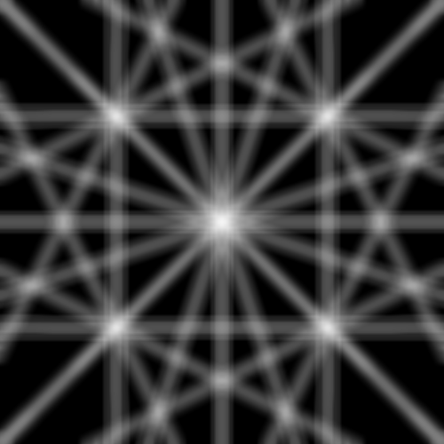
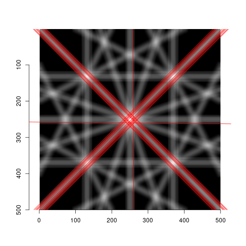

<!-- ------------------------------------------------------------ -->

```{r setup, include=FALSE}
library(knitr)
## opts_knit$set(global.par = TRUE) #
## par(mar=c(2,2,2,2))
library(rgl)
library(rgl.cry)
options(rgl.useNULL = TRUE) # suppress window display
setupKnitr(autoprint = FALSE) # for settings to override mouse callback
opts_chunk$set(
  echo = FALSE, error = FALSE, warning = FALSE, message = FALSE,
  fig.path = "images/"
)
## opts_chunk$set(cache=TRUE)
knit_hooks$set(webgl = hook_webgl)
setupKnitr(autoprint = FALSE) # for settings to override mouse callback
```

<!-- ------------------------------------------------------------ -->
## Kikuchi line drawing

I'm considering implementing Kikuchi line drawing for my studies at <a href="https://github.com/SaitouToshihide/rgl.cry/tree/DiffractionCone">https://github.com/SaitouToshihide/rgl.cry/tree/DiffractionCone</a>.

```{r, eval=FALSE, echo=TRUE}
  dp_demo(system.file("cubic_i.cif", package = "rgl.cry"), zoom = 0.03, res = 1.3)
  ##rgl::snapshot3d("cubic_i_01.png", fmt="png", width=500, height=500, webshot = FALSE)
  dp_demo(system.file("cubic_i.cif", package = "rgl.cry"), zoom = 0.0005, res = 1.3)
  ##rgl::snapshot3d("cubic_i_02.png", fmt="png", width=500, height=500, webshot = FALSE)
```
<div style="margin: 3% 15%; display: flex; flex-wrap: wrap; justify-content: center;">
<div style="width: 45%; height: 45%;">
![Kikuchi lines of BCC structure along the [0 0 1] axis.](./images/cubic_i_01.png){width=100%}
</div>
<div style="width: 10%;"></div>
<div style="width: 45%; height: 45%;">
{width=100%}
</div>
<div style="justify-content: center;">Images while debugging.</div>
</div>

#### Installation
```{r, eval=FALSE, echo=TRUE}
  library(devtools)

  install_github("SaitouToshihide/rgl.cry", ref="b2638c7")
```

#### Usage.
Run ``dp_demo()``.
```{r, eval=FALSE, echo=TRUE}
  dp_demo() # default CIF data are loaded.
```
Let's see another crystal system.
```{r, eval=FALSE, echo=TRUE}
  dp_demo(system.file("triclinic_p.cif", package = "rgl.cry"), zoom = 0.03, res = 2.0)
  ##rgl::snapshot3d("triclinic_p_001_01.png", fmt="png", width=500, height=500, webshot = FALSE)
  dp_demo(system.file("triclinic_p.cif", package = "rgl.cry"), zoom = 0.0003, res = 2.0)
  ##rgl::snapshot3d("triclinic_p_001_02.png", fmt="png", width=500, height=500, webshot = FALSE)
```
<div style="margin: 3% 15%; display: flex; flex-wrap: wrap; justify-content: center;">
<div style="width: 45%; height: 45%;">
{width=100%}
</div>
<div style="width: 10%;"></div>
<div style="width: 45%; height: 45%;">
{width=100%}
</div>
<div style="justify-content: center;">Triclinic crystal.</div>
</div>
In this case, even in a triclinic lattice, the diffraction spots align with the Kikuchi line when viewed from the [0 0 1] direction (see the zoomed image on the right). However, if the viewing direction is changed to another crystal zone axis, the diffraction spots will deviate from the Kikuchi line. This occurs because the lattice vector and reciprocal lattice vector are not parallel, causing the normal vector of the plane denoted by Miller indices to also not be parallel to its diffraction vector.
Let's draw the (1 1 0) plane.
```{r, eval=FALSE, echo=TRUE}
cry_demo()
align("90 0")
align("0 50") #

library(pryr)

lCIF <- rgl.cry:::pkg$inst[[nrow(rgl.cry:::pkg$inst), "lCIF"]]
a <- lCIF$HEADER$CELL$A$VAL
b <- lCIF$HEADER$CELL$B$VAL
c <- lCIF$HEADER$CELL$C$VAL
aa <- lCIF$HEADER$CELL$ALPHA$VAL # degree
bb <- lCIF$HEADER$CELL$BETA$VAL
cc <- lCIF$HEADER$CELL$GAMMA$VAL
mat01 <- cry::xtal_mat02(a, b, c, aa, bb, cc)

vertices <- rbind(c(1,0,0), c(1,0,1), c(0,1,1), c(0,1,0))
vertices <- t(apply(vertices, 1, function(v) v %*% mat01))
combinations <- c(1,2,3,1, 1,4,3,1)
rgl::shade3d(rgl::mesh3d(vertices, quads = combinations), col = "blue", alpha = 0.9)

vertices <- rbind(c(1,0,0), c(1,0,1), c(0,1,1), c(0,1,0))
vertices <- t(apply(vertices, 1, function(v) v + c(1, 0, 0) + c(0, 0, 0)))
vertices <- t(apply(vertices, 1, function(v) v %*% mat01))
rgl::shade3d(rgl::mesh3d(vertices, quads = combinations), col = "green", alpha = 0.9)
##rgl::snapshot3d("triclinic_p.png", fmt="png", width=500, height=500, webshot = FALSE)
```
We can observe that the repetition of (1 1 0) planes appears inclined in real space. However, in reciprocal space, this repetition lies parallel to the xy-plane when first displayed.

<div style="margin: 3% 15%; display: flex; flex-wrap: wrap; justify-content: center;">
```{r}
null <- cry_demo(system.file("triclinic_p.cif", package = "rgl.cry"))
align("90 0")
align("0 55.27") #
rgl::par3d(zoom=1.0)

library(pryr)

lCIF <- rgl.cry:::pkg$inst[[nrow(rgl.cry:::pkg$inst), "lCIF"]]
a <- lCIF$HEADER$CELL$A$VAL
b <- lCIF$HEADER$CELL$B$VAL
c <- lCIF$HEADER$CELL$C$VAL
aa <- lCIF$HEADER$CELL$ALPHA$VAL # degree
bb <- lCIF$HEADER$CELL$BETA$VAL
cc <- lCIF$HEADER$CELL$GAMMA$VAL
mat01 <- cry::xtal_mat02(a, b, c, aa, bb, cc)
vertices <- rbind(c(1,0,0), c(1,0,1), c(0,1,1), c(0,1,0))
vertices <- t(apply(vertices, 1, function(v) v %*% mat01))
combinations <- c(1,2,3,1, 1,4,3,1)
rgl::shade3d(rgl::mesh3d(vertices, quads = combinations), col = "blue", alpha = 0.9)

vertices <- rbind(c(1,0,0), c(1,0,1), c(0,1,1), c(0,1,0))
vertices <- t(apply(vertices, 1, function(v) v + c(1, 1, 0)))
vertices <- t(apply(vertices, 1, function(v) v %*% mat01))
rgl::shade3d(rgl::mesh3d(vertices, quads = combinations), col = "green", alpha = 0.9)

cry.panel.id <- subsceneInfo()$id
cry.widget.id <- subsceneInfo()$parent
useSubscene3d(cry.widget.id)
cry.root.id <- subsceneInfo()$parent
useSubscene3d(cry.panel.id)

js3 <- readLines("cb_cry.js")
js3 <- sub("%subidPanel%", cry.panel.id, js3)
js3 <- sub("%subidWidget%", cry.widget.id, js3)
js3 <- sub("%subidRoot%", cry.root.id, js3)
js3 <- sub("%begin%", "begin3", js3)
js3 <- sub("%update%", "update3", js3)
js3 <- sub("%end%", "end3", js3)

scene3 <- setUserCallbacks("left",
  begin = "begin3",
  update = "update3",
  end = "end3",
  scene = scene3d(minimal = FALSE),
  subscene = cry.panel.id,
  applyToScene = TRUE,
  applyToDev = FALSE,
  javascript = js3
)

rglwidget(scene3, width = 0.45 * figWidth(), height = 0.45 * figWidth())
```
</div>


Let's check this numerically.
```{r, eval=FALSE, echo=TRUE}
> lCIF <- rgl.cry:::pkg$inst[[nrow(rgl.cry:::pkg$inst), "lCIF"]]
> a <- lCIF$HEADER$CELL$A$VAL
> b <- lCIF$HEADER$CELL$B$VAL
> c <- lCIF$HEADER$CELL$C$VAL
> aa <- lCIF$HEADER$CELL$ALPHA$VAL # degree
> bb <- lCIF$HEADER$CELL$BETA$VAL
> cc <- lCIF$HEADER$CELL$GAMMA$VAL
> mat01 <- cry::xtal_mat02(a, b, c, aa, bb, cc)
> ea1 <- as.numeric(c(1, 0, 0) %*% mat01)
> ea2 <- as.numeric(c(0, 1, 0) %*% mat01)
> ea3 <- as.numeric(c(0, 0, 1) %*% mat01)

> library(pracma)
> V <- as.numeric(ea1 %*% cross(ea2, ea3))
> eb1 <- cross(ea2, ea3) / V
> eb2 <- cross(ea3, ea1) / V
> eb3 <- cross(ea1, ea2) / V

## [1 1 0] in real space.
> 1*ea1 + 1*ea2 + 0*ea3
[1] 6.554986 9.455095 5.356230

## [1 1 0] in reciprocal space. z = 0
> 1*eb1 + 1*eb2 + 0*eb3
[1] 0.1020649 0.1407670 0.0000000
```


<!-- ------------------------------ -->
## Hough transformation

Prepare image.
```{r, eval=FALSE, echo=TRUE}
library(rgl.cry)

dp_demo(system.file("cubic_i.cif", package = "rgl.cry"), zoom = 0.03, res = 1.3)
## Remove spot, label, etc.
rgl::pop3d(tag = c("rlpoints0", "rlpoints1", "rlpoints2"))
objIds <- rgl::ids3d(tag = TRUE, subscene = 0)
objIds <- objIds[grep("^rlpoints[4-5].*", objIds$tag), ]
rgl::pop3d(id = objIds$id)
## remove manually in this way
rgl::ids3d(subscene = 0)
##rgl::pop3d(id = 16)
rgl::par3d(zoom = 0.4)
## Save the image.
rgl::snapshot3d("cubic_i_03.png", fmt="png", width=500, height=500, webshot = FALSE)
```
Utilize ImageMagick to blur, grayscale conversion, and inversion to achieve a visual representation that resembles the original observed image.
((In this case, procedures based on theory can be considered, but in general image applications, what methods are there for converting basic features into actual images, and what would happen if they were applied? Applying image blur can be motivated by our visual perception or by limitations inherent in the observation process, making it a common image effect.))
```{r, eval=FALSE, echo=TRUE}
  % convert -blur 10x10 cubic_i_03.png -colorspace Gray -negate cubic_i_03bw.png
```
You can also use the magick package.
```{r, eval=FALSE, echo=TRUE}
library(magick)

img <- image_read("cubic_i_03.png")
img <- image_blur(img, 10, 10)
img <- image_convert(img, type = 'grayscale')
img <- image_negate(img)
image_browse(img)
image_write(img, path = "cubic_i_03bw.png", format = "png")
```
<div style="margin: 3% 15%; display: flex; flex-wrap: wrap; justify-content: center;">
<div style="width: 45%; height: 45%;">
{width=100%}
</div>
<div style="width: 10%;"></div>
<div style="width: 45%; height: 45%;">
{width=100%}
</div>
<div style="justify-content: center;">The original image and the image after applying the effect.</div>
</div>

Reconstruct the line from Hough transform data and overlay it onto the original image.
```{r, eval=FALSE, echo=TRUE}
library(imager)

file <- "cubic_i_03bw.png"
im <- load.image(file)
plot(im)
hough_line(im, ntheta=500) %>% plot # Very hard to see
df <- hough_line(im, ntheta=500, data.frame=TRUE)
df <- subset(df, score > quantile(score, .9991))
df <- df[which(df$score != 0),]
##png(filename="cubic_i_03ovl.png", width=500, height=500, units="px")
plot(im)
nfline(df$theta, df$rho, col="blue")
##dev.off()
```
<div style="margin: 3% 30%; display: flex; flex-wrap: wrap; justify-content: space-around;">
{width=100%}
</div>

To improve the visual representation of Hough transform data, I used the following settings:
```{r, eval=FALSE, echo=TRUE}
library(ggplot2)

##png(filename="cubic_i_03ht.png", width=500, height=500, units="px")
ggplot(data = df) +
  geom_point(aes(x = theta, y = rho, color = score), size = 0.1) +
  scale_color_gradient(low = "#56B1F7", high = "#132B43") +
  theme(panel.background = element_rect(fill = "gray90"),
      panel.grid.major = element_blank(),
      panel.grid.minor = element_blank(),
      plot.background = element_rect(fill = "white"))
##dev.off()
```
<div style="margin: 3% 30%; display: flex; flex-wrap: wrap; justify-content: space-around;">
{width=100%}
</div>


We detect lines in the image using Hough transform and keep only the highest-scoring 1-0.9991 %.
Check this.
```{r, eval=FALSE, echo=TRUE}
> plot(im)
> nfline(df$theta, df$rho, col="blue")

## To plot the detected line, substitute the values of theta and rho obtained
## from the Hough transform into the equation cos(theta)*x + sin(theta)*y = rho.
## This can be done using nfline. Let's check it out.

> df[which(df$score == max(df$score)), ]
          theta      rho    score
442140 3.928565 -362.169 11.64875
>
## y = (rho - cos(theta)*x)/sin(theta)
## y = (rho - cos(3.928565)*x)/sin(3.928565)

> f1 <- function(x){ (-362.169 + 0.7059928*x) / -0.708219 }
> par(new=T)
> plot(f1, n=1000, col="red", xaxt="n", yaxt="n", xlab="", ylab="")
```

Utilize the pracma package for peak detection.
```{r, eval=FALSE, echo=TRUE}
library(pracma)

im <- load.image(file)

df <- hough_line(im, ntheta=500, data.frame=TRUE)

## Treating a vertical raster column (rho) as a one-dimensional data.
## Then find peaks using findpeaks (adjust minpeakheight and threshold as needed).
data_vector_rho <- df$score
peak_indices_rho <- findpeaks(data_vector_rho, minpeakheight = 2.5, threshold = 0.5)
df4 <- df[peak_indices_rho[,2],]

##png(filename="cubic_i_04ovl.png", width=500, height=500, units="px")
plot(im, xaxs = "i", yaxs = "i")
nfline(df4$theta, df4$rho, col="red")
##dev.off()

##png(filename="cubic_i_04ht.png", width=500, height=500, units="px")
ggplot(data = df4) +
  geom_point(aes(x = theta, y = rho, color = score), size = 0.1) +
  scale_color_gradient(low = "#56B1F7", high = "#132B43") +
  theme(panel.background = element_rect(fill = "gray90"),
      panel.grid.major = element_blank(),
      panel.grid.minor = element_blank(),
      plot.background = element_rect(fill = "white"))
##dev.off()

## The four major lines share identical slope and Y-intercept. This
## characteristic corresponds to the existence of 4 major spots.

## This does not lead to further improvement:
## Treating a horizontal raster row (theta).
data_vector_theta <- df[order(df[, "rho"], df[, "theta"]), "score"]
peak_indices_theta <- findpeaks(data_vector_rho, minpeakheight = 2.5, threshold = 0.5)
nrho <- nrow(df[which(df$theta == 0),])
row_coords <- ceiling(peak_indices_theta[,2] / nrho)
col_coords <- peak_indices_theta[,2] %% nrho
df5 <- df[nrho * row_coords + col_coords,]
## Or even further, multiply by the vertical result?
```

<div style="margin: 3% 5%; display: flex; flex-wrap: wrap; justify-content: center;">
<div style="width: 45%; height: 45%;">
{width=100%}
</div>
<div style="width: 10%;"></div>
<div style="width: 45%; height: 45%;">
{width=100%}
</div>
<div style="justify-content: center;">The major peak selection and its result.</div>
</div>
