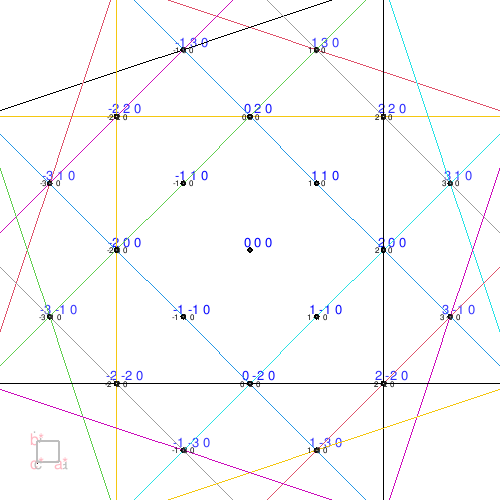

<!-- ------------------------------------------------------------ -->

```{r setup, include=FALSE}
library(knitr)
## opts_knit$set(global.par = TRUE) #
## par(mar=c(2,2,2,2))
library(rgl)
library(rgl.cry)
options(rgl.useNULL = TRUE) # suppress window display
setupKnitr(autoprint = FALSE) # for settings to override mouse callback
opts_chunk$set(
  echo = FALSE, error = FALSE, warning = FALSE, message = FALSE,
  fig.path = "images/"
)
## opts_chunk$set(cache=TRUE)
knit_hooks$set(webgl = hook_webgl)
setupKnitr(autoprint = FALSE) # for settings to override mouse callback
```

```{css, echo=FALSE}
div.myfig1 {
  margin: 3% 3%;
  display: flex;
  flex-wrap: wrap;
  justify-content: center;
  gap: 15%;
}
div.mycap1 {
  width: 100%;
  display: flex;
  justify-content: center;
}
```

<!-- ------------------------------------------------------------ -->
# rgl.cry

This is a use case for the ``cry`` and ``rgl`` packages.
This package provides tools for selected area electron diffraction (SAED) pattern and crystal structure visualization using the ``rgl`` and ``cry`` packages.
In particular, the ``cry_demo()`` and ``dp_demo()`` function read files in CIF (Crystallographic Information Framework) format and display SAED patterns and crystal structures.
The ``dp_demo()`` function also performs simple simulations of powder X-ray diffraction (PXRD) patterns, and the results can be saved to a file in the working directory.

The package has been tested on several platforms, including Linux on Crostini with a Core™ m3-8100Y Chromebook, I found that even on this low-powered platform, the performance was acceptable.


<!-- ------------------------------------------------------------ -->
## Installation
```{r, eval=FALSE, echo=TRUE}
install.packages("rgl.cry")
```


<!-- ------------------------------------------------------------ -->
## Example

A CIF file is read, and a reciprocal lattice map with a cell widget is drawn.
In this example, since no specific file path is provided, the system's default demonstration CIF data is loaded automatically.
```{r, eval=FALSE, echo=TRUE}
dp_demo()
```

A CIF file is read, and a crystal structure with a axis widget is drawn.
```{r, eval=FALSE, echo=TRUE}
cry_demo()
```

The following is a working snapshot.
Note that while these WebGL graphics are fully interactive, their mouse event behaviors are simulated using downstream JavaScript rather than being processed in real-time by an active R session.

<!--


 -->

<div class="myfig1">
```{r}

## First figure
null <- dp_demo()
rgl::pop3d(tag = c("rlpoints0", "rlpoints2"))
objIds <- rgl::ids3d(tag = TRUE, subscene = 0)
objIds <- objIds[(objIds$tag == "rlpoints1"), ]$id
dp.panel.id <- subsceneInfo()$id
dp.widget.id <- subsceneInfo()$parent
useSubscene3d(dp.widget.id)
dp.root.id <- subsceneInfo()$parent
useSubscene3d(dp.panel.id)
dp.scene3d <- scene3d(minimal = FALSE)

## Second figure
null <- cry_demo()
cry.panel.id <- subsceneInfo()$id
cry.widget.id <- subsceneInfo()$parent
useSubscene3d(cry.widget.id)
cry.root.id <- subsceneInfo()$parent
useSubscene3d(cry.panel.id)
cry.scene3d <- scene3d(minimal = FALSE)


## Callback function settings

js1 <- readLines("cb_dp.js")
js1 <- sub("%dpPanel%", dp.panel.id, js1)
js1 <- sub("%dpWidget%", dp.widget.id, js1)
js1 <- sub("%dpRoot%", dp.root.id, js1)
js1 <- sub("%idpoints%", objIds, js1)
js1 <- sub("%cryPanel%", cry.panel.id, js1)
js1 <- sub("%cryWidget%", cry.widget.id, js1)
js1 <- sub("%cryRoot%", cry.root.id, js1)
js1 <- sub("%begin%", "begin1", js1)
js1 <- sub("%update%", "update1", js1)
js1 <- sub("%end%", "end1", js1)

js2 <- readLines("cb_cry.js")
js2 <- sub("%cryPanel%", cry.panel.id, js2)
js2 <- sub("%cryWidget%", cry.widget.id, js2)
js2 <- sub("%cryRoot%", cry.root.id, js2)
js2 <- sub("%idpoints%", objIds, js2)
js2 <- sub("%dpPanel%", dp.panel.id, js2)
js2 <- sub("%dpWidget%", dp.widget.id, js2)
js2 <- sub("%dpRoot%", dp.root.id, js2)
js2 <- sub("%begin%", "begin2", js2)
js2 <- sub("%update%", "update2", js2)
js2 <- sub("%end%", "end2", js2)

scene1 <- setUserCallbacks("left",
  begin = "begin1",
  update = "update1",
  end = "end1",
  scene = dp.scene3d,
  subscene = dp.panel.id,
  applyToScene = TRUE,
  applyToDev = FALSE,
  javascript = js1
)

scene2 <- setUserCallbacks("left",
  begin = "begin2",
  update = "update2",
  end = "end2",
  scene = cry.scene3d,
  subscene = cry.panel.id,
  applyToScene = TRUE,
  applyToDev = FALSE,
  javascript = js2
)
```
```{r}
rglwidget(scene1, width = 0.35*figWidth(), height = 0.35*figWidth())
rglwidget(scene2, width = 0.35*figWidth(), height = 0.35*figWidth())
```
</div>


<!-- ------------------------------ -->
### Utility functions

The crystal and diffraction pattern are aligned and displayed.
```{r, eval=FALSE, echo=TRUE}
align("a")
align("ra")
align("30 30") # x, y (deg)
```

Select one or more atoms or reciprocal lattice points in the window.
The labels and Miller indices of the selected atoms or lattice points will be displayed.
```{r, eval=FALSE, echo=TRUE}
> dp_demo()
[1] 1
> select()
To select points, drag the left mouse button.
To finish, press ESC.
.
 [1] "1 1 -3" "1 0 -2" "2 0 -2" "1 1 -1" "1 0 0"  "2 0 0"  "1 1 1"  "1 0 2" 

> cry_demo()
[1] 2
> select()
To select points, drag the left mouse button.
To finish, press ESC.
.
[1] "Ti1" "Ti1"
```


<!-- ------------------------------ -->
### Extras
``dp_demo()`` can perform PXRD pattern simulation.
The result is saved as a file in the current directory by specifying options like this:
```{r, eval=FALSE, echo=TRUE}
## Output the simulation results of the PXDR pattern as a file.
dp_demo(xrd = TRUE)
```
The file looks like this:
```zsh
% sort -n +7 rgl.cry.dp.demo.2024-02-26_000000.dat
     h  k  l        d       absF         lp twotheta
137  0  0  0      Inf 308.117522        Inf  0.00000
136 -1  0  0 5.583222  17.389409 101.955123 15.87322
138  1  0  0 5.583222  17.389409 101.955123 15.87322
128  0 -2  0 4.453238  40.628676  63.820476 19.93782
146  0  2  0 4.453238  40.628676  63.820476 19.93782
129  1 -2  0 4.142661  17.444203  54.849532 21.44963
145 -1  2  0 4.142661  17.444203  54.849532 21.44963
```

You can plot the data as follows:

```{r, echo=TRUE, fig.asp=0.5, out.width="90%", fig.align="center", fig.cap=""}
df <- read.table(
  file = "data/rgl.cry.dp.demo.2024-02-26_000000.dat",
  header = TRUE,
  sep = "",
  comment.char = "#",
  blank.lines.skip = TRUE,
  skipNul = TRUE)

df <- df[-which(df$absF == 0 | df$d == Inf | df$twotheta == 0), ]

df2 <- data.frame(twotheta = df$twotheta, I = (df$lp * df$absF^2))
df2 <- aggregate(df2$I, by = list(df2$twotheta), sum)
names(df2) <- c("twotheta", "I")
df2 <- data.frame(twotheta = df2$twotheta, I = 100 * df2$I / max(df2$I))

plot(df2,
  xlim = c(10, 80), ylim = c(0, 105), type = "p", cex = 0.02, xaxs = "i", yaxs = "r",
  xlab = "", ylab = ""
)
mtext(~ italic("2θ"), side = 1, line = 3)
mtext(~ italic("I"), side = 2, line = 3)
segments(x0 = df2$twotheta, y0 = 0, x1 = df2$twotheta, y1 = df2$I)
```

In the plot above, a vertical line segment is drawn perpendicular to the baseline at each specific diffraction angle ($2\theta$), mapping the expected peak intensities.
Note that overlapping diffraction peaks sharing the exact same position are not accumulated in this basic line plot.
Alternatively, the plot below models a continuous intensity distribution curve rather than discrete line vectors. By mapping a continuous distribution around individual diffraction angles, multiple overlapping intensities can be systematically accumulated and smoothed out:
```{r, echo=TRUE, fig.asp=0.5, out.width="90%", fig.align="center", fig.cap=""}
f1 <- function(x) {
  w <- 0.02 # hwhm (= fwhm/2)
  r <- 0.01 # ratio of Lorentzian and Gaussian
  sum(apply(df2, 1, function(v) { # sum of pseudo-Voigt functions at each position
    h <- v["I"]
    t <- v["twotheta"]
    (h * ((1 - r) * exp(-log(2) * ((x - t) / w)**2) + r / (1 + ((x - t) / w)**2)))
  }))
}

x <- do.call(c, sapply(df2$twotheta, function(v) {
  as.list(seq(v - 3, v + 3, 0.2)) # A smaller list length result in shorter calculation time.
}))
x <- unique(sort(x))

df3 <- data.frame(twotheta = x, I = sapply(x, f1))
df3 <- data.frame(twotheta = df3$twotheta, I = 100 * df3$I / max(df3$I))

plot(df3,
  xlim = c(10, 80), ylim = c(0, 105), type = "l", xaxs = "i", yaxs = "r",
  xlab = "", ylab = ""
)
mtext(~ italic("2θ"), side = 1, line = 3)
mtext(~ italic("I"), side = 2, line = 3)
```


<!-- ------------------------------------------------------------ -->

## References

<div id="refs"></div>

## Acknowledgment

I would like to express my gratitude to the rgl, cry packages, and R for making this work possible.  The data for the scattering factors is based on the data from the KEK Report @sc_table_kek.  For the coloring of the atoms, I used @mol_color, and for the atomic radii, I used @enwiki:1179864711.

<!-- ------------------------------ -->

## Features under consideration

I'm considering implementing Kikuchi line drawing for my studies at <a href="https://github.com/SaitouToshihide/rgl.cry/tree/DiffractionCone">https://github.com/SaitouToshihide/rgl.cry/tree/DiffractionCone</a> and <a href="https://saitoutoshihide.github.io/rgl.cry/features.html">my study zone</a>.

<div class="myfig1">
<div style="width: 35%; height: 35%;">
![BCC structure along the [0 0 1] axis.](./images/cubic_i_01.png){width=90%}
</div>
<div style="width: 35%; height: 35%;">
{width=90%}
</div>
</div>

<!-- ------------------------------ -->

## Alternative Use Case: rgl and bio3d Integration

Beyond low-molecular-weight crystallography, the ``rgl`` engine offers a powerful framework for bridging the micro- and macromolecular realms. Combining ``rgl`` with ``bio3d`` enables the synchronized rendering of smooth protein secondary structure ribbons directly within the interactive 3D graphics environment.

The following implementation provides a complete workflow for visualizing the plant protein Crambin (PDB ID: 1CRN). Please note that this evaluation utilizes the structural data ``1CRN.cif`` bundled directly within the package's inst/ directory.

Note: This implementation, including the geometric correction algorithms and interactive widget generation, was developed in collaboration with Gemini (AI-assisted).


```{r macromolecule_rgl_bio3d, echo=FALSE, results='hide'}
## -------------------------------------------------------------------------
## Visualization of Macromolecules from mmCIF/PDB
##
##   Usage:
##     % R
##     > source("thisfile.R")
##
##     % Rscript thisfile.R
##
##   Development Note:
##     This script, along with its core geometric correction algorithms (including
##     phase unwrapping and orientation alignment), was developed through a close,
##     collaborative workflow with Gemini (LLM). 
##
##     It showcases the exceptional versatility of rgl as a 3D graphics engine
##     and its synergy with package integration.
## -------------------------------------------------------------------------

library(bio3d)
library(rgl)

my <- getr3dDefaults()
my$windowRect <- c(0, 0, 500, 500)
my$FOV <- 0 # orthographic projection
my$userMatrix <- identityMatrix()
my$userProjection <- identityMatrix()
my$cex <- 1.2
my$font <- 3 # italic

## Ensure window opened at specified size
open3d(params = my, antialias = 8)
par3d(windowRect = c(0, 0, 500, 500))
par3d(windowRect = c(0, 0, 500, 500))

## Dummy objects to fix the bounding box
spheres3d(c(-25,-25,-25), color="black", r=1, alpha=0)
spheres3d(c(35,35,35), color="black", r=1, alpha=0)

view3d(theta=0, phi=0, zoom=0.6, fov=0)

## Viewport and Camera Orientation Matrix
userMatrix <- matrix(c(
    0.28,  0.64, -0.72,  0,
    0.75,  0.32,  0.58,  0,
    0.60, -0.70, -0.39,  0,
    0,      0,      0,   1.5
), nrow = 4, ncol = 4, byrow = TRUE)

par3d(userMatrix = userMatrix)


## =========================================================================
## Core Geometric Calculation Logic
## =========================================================================

## [Utility] 3D Cross Product Function
ext_prod <- function(a, b) {
    c(a[2]*b[3] - a[3]*b[2], 
      a[3]*b[1] - a[1]*b[3], 
      a[1]*b[2] - a[2]*b[1])
}

## [Utility] Neighbor Smoothing (Edge-safe boundary handling)
smooth_segment <- function(start_res, end_res, ca_matrix, vco_matrix, n_res) {
    ca_out  <- ca_matrix
    vco_out <- vco_matrix
    
    for (i in start_res:end_res) {
        idx_start <- max(1, i - 1)
        idx_end   <- min(n_res, i + 1)
        window_range <- idx_start:idx_end
        
        if (i == 1 || i == n_res) {
            window_range <- i
        }
        
        if (length(window_range) > 1) {
            ca_out[i, ]  <- colMeans(ca_matrix[window_range, , drop = FALSE])
            vco_out[i, ] <- colMeans(vco_matrix[window_range, , drop = FALSE])
        }
    }
    return(list(ca = ca_out, vco = vco_out))
}

## Data Loading
##
## NOTE: While this mmCIF file can be downloaded directly from the RCSB PDB, 
## the geometric processing here explicitly separates the handling of secondary 
## structures. For the alpha-helices, the tight structural trace is computed 
## directly from scratch using our spline interpolation algorithms. For the 
## beta-sheets, since this specific file lacks explicit structural annotations, 
## we implement a manual residue range mapping based on known literature for 1CRN 
## to apply our phase unwrapping and dot-product orientation corrections.
cif_path <- system.file("1CRN.cif", package = "rgl.cry")
if (cif_path == "") {
    cif_path <- "../inst/1CRN.cif"
}
pdb <- read.cif(cif_path)

## Extract coordinates for C-alpha and backbone carbonyl oxygen
ca.inds   <- atom.select(pdb, "calpha")
ca.coords <- pdb$atom[ca.inds$atom, c("resno", "insert", "chain", "x", "y", "z")]
ca.coords[, c("x", "y", "z")] <- ca.coords[, c("x", "y", "z")]

o.inds   <- atom.select(pdb, elety = "O")
o.coords <- pdb$atom[o.inds$atom, c("resno", "insert", "chain", "x", "y", "z")]
o.coords[, c("x", "y", "z")] <- o.coords[, c("x", "y", "z")]

## Pair and sort C-alpha and carbonyl oxygen by residue number
paired_backbone <- merge(ca.coords, o.coords, by = c("chain", "resno", "insert"), suffixes = c(".ca", ".o"))
paired_backbone <- paired_backbone[order(paired_backbone$resno), ]

ca.pts <- as.matrix(paired_backbone[, c("x.ca", "y.ca", "z.ca")])
o.pts  <- as.matrix(paired_backbone[, c("x.o", "y.o", "z.o")])
n_residues <- nrow(paired_backbone)

## Compute raw direction vectors from C-alpha to carbonyl oxygen (Cα -> O)
v_co_raw <- o.pts - ca.pts
v_co_raw <- v_co_raw / sqrt(rowSums(v_co_raw^2))

## [Beta-Sheet Orientation Alignment]
## In beta-sheets, the Cα->O vectors naturally alternate orientations by ~180°
## (left-right-left). To prevent ribbon twisting, we evaluate the dot product
## between the current vector and the preceding aligned vector. If the dot
## product is negative, the current vector direction is inverted to maintain
## consistent ribbon surface polarity.
v_co_aligned <- matrix(0, nrow = n_residues, ncol = 3)
v_co_aligned[1, ] <- v_co_raw[1, ] / sqrt(sum(v_co_raw[1, ]^2))

for(i in 2:n_residues) {
    v_vec <- v_co_raw[i, ]
    is_sheet <- (i >= 1 && i <= 4) || (i >= 32 && i <= 35)
    if (is_sheet) {
        if(sum(v_vec * v_co_aligned[i-1, ]) < 0) v_vec <- -v_vec
    }
    v_co_aligned[i, ] <- v_vec / sqrt(sum(v_vec^2))
}

## Structural Smoothing Routine
ca.pts_smooth <- ca.pts
v_co_smooth   <- v_co_aligned

if (as.character(pdb$call[[1]]) == "read.cif") {
    ## Here we also apply the manual residue range mapping explained in the data
    ## loading note.
    ## C-alpha coordinates are smoothed ONLY within the specific beta-sheet
    ## regions (residues 1-4, 32-35) to preserve the tight helical structural
    ## integrity of the alpha-helices.
    res_sheet1 <- smooth_segment(1, 4, ca.pts_smooth, v_co_smooth, n_residues)
    ca.pts_smooth[1:4, ] <- res_sheet1$ca[1:4, ]
    
    res_sheet2 <- smooth_segment(32, 35, ca.pts_smooth, v_co_smooth, n_residues)
    ca.pts_smooth[32:35, ] <- res_sheet2$ca[32:35, ]
    
    ## Smooth carbonyl oxygen vectors globally across all residues 
    ## to reduce structural noise and minor fluctuations.
    total_smooth <- smooth_segment(1, n_residues, ca.pts, v_co_aligned, n_residues)
    v_co_smooth   <- total_smooth$vco
}


## ------------------------------------------------------------
## Spline Interpolation (Upsampling the C-alpha trace by 20x)
## ------------------------------------------------------------
upsample_factor <- 20
num_points <- length(ca.inds$atom) * upsample_factor
spline_cx <- spline(1:n_residues, ca.pts_smooth[,1], n = num_points)$y
spline_cy <- spline(1:n_residues, ca.pts_smooth[,2], n = num_points)$y
spline_cz <- spline(1:n_residues, ca.pts_smooth[,3], n = num_points)$y
spline_ccoords <- cbind(spline_cx, spline_cy, spline_cz)
n_pts <- nrow(spline_ccoords)

res_mapping <- seq(1, n_residues, length.out = num_points)


## ------------------------------------------------------------
## Define Secondary Structure Dimensions (Widths)
## ------------------------------------------------------------
## Here we apply the manual residue range mapping explained in the data loading note.
## The dimensions for helices, sheets, and beta-sheet arrowheads are hardcoded below.
spline_width <- rep(0.2, num_points)
if (as.character(pdb$call[[1]]) == "read.cif") {
    spline_width[res_mapping >= (7 - 0.5)  & res_mapping <= (19 + 0.5)] <- 1.4  # Helix 1
    spline_width[res_mapping >= (23 - 0.5) & res_mapping <= (30 + 0.5)] <- 1.4  # Helix 2
    spline_width[res_mapping >= (1 - 0.5)  & res_mapping <= (4 + 0.5)]  <- 1.4  # Sheet 1
    spline_width[res_mapping >= (32 - 0.5) & res_mapping <= (35 + 0.5)] <- 1.4  # Sheet 2

    # Define dimensions for beta-sheet arrowheads
    arrow_tip_width <- 0.15
    arrow_max_width <- 2.2

    idx_sheet1_head <- which(res_mapping >= (4 - 0.5) & res_mapping <= (4 + 0.5))
    spline_width[idx_sheet1_head] <- seq(arrow_max_width, arrow_tip_width, length.out = length(idx_sheet1_head))

    idx_sheet2_head <- which(res_mapping >= (35 - 0.5) & res_mapping <= (35 + 0.5))
    spline_width[idx_sheet2_head] <- seq(arrow_max_width, arrow_tip_width, length.out = length(idx_sheet2_head))
}


## ------------------------------------------------------------
## Parallel Transport Frame + Phase Unwrapping Twist Interpolation
## ------------------------------------------------------------

## Calculate forward tangent vectors along the upsampled C-alpha path
tangents <- matrix(0, nrow = n_pts, ncol = 3)
for(i in 2:(n_pts-1)) {
    tangents[i,] <- spline_ccoords[i+1,] - spline_ccoords[i-1,]
}
tangents[1,]     <- spline_ccoords[2,] - spline_ccoords[1,]
tangents[n_pts,] <- spline_ccoords[n_pts,] - spline_ccoords[n_pts-1,]
tangents         <- tangents / sqrt(rowSums(tangents^2))

## Compute a twist-free reference frame using Parallel Transport
up_pt   <- matrix(0, nrow = n_pts, ncol = 3)
side_pt <- matrix(0, nrow = n_pts, ncol = 3)

# Initialize the starting frame
init_side <- ext_prod(v_co_smooth[1, ], tangents[1, ])
side_pt[1, ] <- init_side / sqrt(sum(init_side^2))
up_pt[1, ]   <- ext_prod(tangents[1, ], side_pt[1, ])

for(i in 2:n_pts) {
    v_prev <- tangents[i-1, ]
    v_curr <- tangents[i, ]
    rot_axis <- ext_prod(v_prev, v_curr)
    sin_rot  <- sqrt(sum(rot_axis^2))
    cos_rot  <- sum(v_prev * v_curr)
    
    if(sin_rot > 1e-6) {
        rot_axis <- rot_axis / sin_rot
        u_prev   <- up_pt[i-1, ]
        u_curr   <- u_prev * cos_rot + ext_prod(rot_axis, u_prev) * sin_rot + rot_axis * sum(rot_axis * u_prev) * (1 - cos_rot)
        up_pt[i, ] <- u_curr / sqrt(sum(u_curr^2))
    } else {
        up_pt[i, ] <- up_pt[i-1, ]
    }
    side_pt[i, ] <- ext_prod(up_pt[i, ], tangents[i, ])
}

## Calculate the angular "twist" between the reference frame and the actual oxygen vector
residue_twists <- rep(0, n_residues)
for(i in 1:n_residues) {
    pt_idx <- round(1 + (num_points - 1) * (i - 1) / (n_residues - 1))
    ref_side <- side_pt[pt_idx, ]
    act_vco  <- v_co_smooth[i, ]
    
    cos_t <- sum(ref_side * act_vco)
    sin_t <- sum(ext_prod(ref_side, act_vco) * tangents[pt_idx, ])
    residue_twists[i] <- atan2(sin_t, cos_t)
}

## [CRITICAL: Phase Unwrapping to Resolve Geometric Discontinuities]
## The angular data derived from atan2 is bounded within [-pi, +pi]. At structural boundaries,
## sudden artificial 360° phase jumps occur due to coordinate definitions. This routine
## detects these discontinuities and shifts the phase by adding/subtracting multiples of 
## 2*pi, transforming the modular angles into a continuous, unbroken path.
unwrapped_twists <- residue_twists
for(i in 2:n_residues) {
    diff_angle <- unwrapped_twists[i] - unwrapped_twists[i-1]
    
    # If a positive jump exceeds +pi, compensate by subtracting 2*pi
    if (diff_angle > pi) {
        unwrapped_twists[i:n_residues] <- unwrapped_twists[i:n_residues] - 2 * pi
    }
    # If a negative jump drops below -pi, compensate by adding 2*pi
    else if (diff_angle < -pi) {
        unwrapped_twists[i:n_residues] <- unwrapped_twists[i:n_residues] + 2 * pi
    }
}

## Interpolate the unwrapped, clean 1D angles smoothly across the 20x upsampled vertices
spline_twists <- spline(1:n_residues, unwrapped_twists, n = num_points)$y

## Apply the interpolated twist angles to rotate the reference frames into their final orientations
up   <- matrix(0, nrow = n_pts, ncol = 3)
side <- matrix(0, nrow = n_pts, ncol = 3)

for(i in 1:n_pts) {
    theta <- spline_twists[i]
    cost  <- cos(theta)
    sint  <- sin(theta)
    
    u_base <- up_pt[i, ]
    u_rot  <- u_base * cost + ext_prod(tangents[i, ], u_base) * sint
    
    up[i, ]   <- u_rot / sqrt(sum(u_rot^2))
    side[i, ] <- ext_prod(up[i, ], tangents[i, ])
}


## ------------------------------------------------------------
## Draw
## ------------------------------------------------------------

root <- currentSubscene3d() 
newSubscene3d("replace", "replace", "replace", copyShapes = FALSE, parent = root)


## ------------------------------------------------------------
## Cα chain
## ------------------------------------------------------------

id <- spheres3d(ca.coords$x, ca.coords$y, ca.coords$z, radius = 0.3, col = "grey25")
id <- c(id, lines3d(ca.coords$x, ca.coords$y, ca.coords$z, col = "grey", lwd = 2))
widget1 <- rglwidget(width = 0.35*figWidth(), height = 0.35*figWidth())
pop3d(id=id)


## ------------------------------------------------------------
## Cα chain with spline
## ------------------------------------------------------------

my_palette <- colorRampPalette(c("blue", "cyan", "green", "yellow", "red"))(n_pts)

id <- spheres3d(ca.coords$x, ca.coords$y, ca.coords$z, radius = 0.3, col = "grey25")
id <- c(id, lines3d(spline_ccoords, col = my_palette, lwd = 2))
widget2 <- rglwidget(width = 0.35*figWidth(), height = 0.35*figWidth())
pop3d(id=id)


## ------------------------------------------------------------
## 3D Mesh Generation and Rendering
## ------------------------------------------------------------

thickness <- 0.3

quad_coords <- matrix(NA, ncol = 3, nrow = (n_pts - 1) * 16)
quad_colors <- rep(NA, (n_pts - 1) * 16)
idx <- 1

left_top     <- spline_ccoords + side * (spline_width / 2) + up * (thickness / 2)
right_top    <- spline_ccoords - side * (spline_width / 2) + up * (thickness / 2)
left_bottom  <- spline_ccoords + side * (spline_width / 2) - up * (thickness / 2)
right_bottom <- spline_ccoords - side * (spline_width / 2) - up * (thickness / 2)

for(i in 1:(n_pts-1)) {
    current_color <- my_palette[i]

    ## Top Surface
    quad_coords[idx, ]     <- left_top[i, ]
    quad_coords[idx+1, ]   <- right_top[i, ]
    quad_coords[idx+2, ]   <- right_top[i+1, ]
    quad_coords[idx+3, ]   <- left_top[i+1, ]
    
    ## Bottom Surface
    quad_coords[idx+4, ]   <- left_bottom[i, ]
    quad_coords[idx+5, ]   <- right_bottom[i, ]
    quad_coords[idx+6, ]   <- right_bottom[i+1, ]
    quad_coords[idx+7, ]   <- left_bottom[i+1, ]
    
    ## Left Side Wall
    quad_coords[idx+8, ]   <- left_bottom[i, ]
    quad_coords[idx+9, ]   <- left_top[i, ]
    quad_coords[idx+10, ]  <- left_top[i+1, ]
    quad_coords[idx+11, ]  <- left_bottom[i+1, ]
    
    ## Right Side Wall
    quad_coords[idx+12, ]  <- right_bottom[i, ]
    quad_coords[idx+13, ]  <- right_top[i, ]
    quad_coords[idx+14, ]  <- right_top[i+1, ]
    quad_coords[idx+15, ]  <- right_bottom[i+1, ]

    quad_colors[idx:(idx+15)] <- current_color
    idx <- idx + 16
}

## End Cap (Front-most Face)
tip_face_coords <- matrix(NA, ncol = 3, nrow = 4)
tip_face_coords[1, ] <- left_top[1, ]
tip_face_coords[2, ] <- left_bottom[1, ]
tip_face_coords[3, ] <- right_bottom[1, ]
tip_face_coords[4, ] <- right_top[1, ]
tip_face_color <- rep(my_palette[1], 4)

quads3d(quad_coords, col = quad_colors, specular = "white", back = "filled")
quads3d(tip_face_coords, col = tip_face_color, specular = "white", back = "filled")

widget3 <- rglwidget(width = 0.35*figWidth(), height = 0.35*figWidth())


## ------------------------------------------------------------
## Debugging / Atom Vector Layer (Optional)
## ------------------------------------------------------------

## Debug: Visualize coordinate basis vectors utilized for ribbon width metrics

if (TRUE) {

    ## Render C-alpha atoms as CPK-standard dark gray spheres
    spheres3d(ca.coords$x, ca.coords$y, ca.coords$z, radius = 0.3, col = "grey25")

    ## Render carbonyl oxygen atoms as red spheres
    spheres3d(o.coords$x, o.coords$y, o.coords$z, radius = 0.3, col = "red")
    
    ## Trace raw C-alpha coordinates with a continuous backbone line
    lines3d(ca.coords$x, ca.coords$y, ca.coords$z, col = "grey", lwd = 2)


    ## Render accurate vector arrows connecting the paired C-alpha and Oxygen atoms
    v_co_real <- o.pts - ca.pts

    ## Create a coordinate matrix for the line segments (the arrow shafts)
    arrow_segs <- matrix(NA, ncol = 3, nrow = n_residues * 2)
    arrow_segs[seq(1, n_residues * 2, by = 2), ] <- ca.pts # Start coordinates (Cα)
    arrow_segs[seq(2, n_residues * 2, by = 2), ] <- o.pts  # End coordinates (O)

    ## Plot blue lines connecting the paired spheres perfectly
    segments3d(arrow_segs, col = "blue", lwd = 2)


    ## [rgl Native Cone Placement]
    ## This method renders individual 3D meshes sequentially, avoiding the matrix-accumulation 
    ## rotation bug inherent in arrow3d() and ensuring 100% position accuracy.
    for(i in 1:n_residues) {
        # Recalculate the direction vector
        v_dir <- v_co_raw[i, ] 
        
        # Determine the cone tip (at the oxygen center) and base coordinates
        tip_pt  <- o.pts[i, ]
        base_pt <- o.pts[i, ] - (v_dir * 0.4) # Retract by the cone's length
        
        # Generate a native rgl cylinder object tapered into a sharp cone
        # Setting radius = c(base_width, 0) forces a flawless conical shape
        my_cone <- cylinder3d(center = rbind(base_pt, tip_pt), 
                              radius = c(0.18, 0), 
                              sides  = 12, 
                              closed = -2) # Cap the base cleanly
        
        # Render the mesh onto the active scene with shading parameters
        shade3d(my_cone, col = "blue", alpha = 1, specular = "white")
    }


    ## Calculate expanded indices corresponding to the original residue numbers (e.g., 1, 21, 41...)
    target_indices <- round(1 + (num_points - 1) * (1:n_residues - 1) / (n_residues - 1))

    for(i in target_indices[1:3]) {
        arrow3d(spline_ccoords[i,], spline_ccoords[i,]+3*tangents[i,], type = "rotation", n=36, s=0.6, barblen=0.04, col = "red")
        arrow3d(spline_ccoords[i,], spline_ccoords[i,]+3*up[i,], type = "rotation", n=36, s=0.6, barblen=0.04, col = "green")
        arrow3d(spline_ccoords[i,], spline_ccoords[i,]+3*side[i,], type = "rotation", n=36, s=0.6, barblen=0.04, col = "blue")
    }

}

widget4 <- rglwidget(width = 0.35*figWidth(), height = 0.35*figWidth())


## Cross-referencing outputs with 1CRN Mol* renderings on the RCSB PDB 
## website (https://www.rcsb.org/structure/1CRN) reveals deep structural insights.

## end
```

<div class="myfig1">
```{r}
widget1
widget2
widget3
widget4
```
</div>

<details>
<summary style="color: #2c3e50; font-weight: bold; cursor: pointer; padding: 5px;">Click to expand the full macromolecule visualization script</summary>
```{r, ref.label='macromolecule_rgl_bio3d', echo=TRUE, eval=FALSE}
```
</details>


<!-- ------------------------------ -->

<script>
  window.addEventListener("load", function () {

      const widgets = document.getElementsByClassName("rglWebGL html-widget");

      for (const item of widgets) {
        root = item.rglinstance.scene.rootSubscene;
        if (root == window.cryRoot) {
          window.cryObj = item.rglinstance
        }
        else if (root == window.dpRoot) {
          window.dpObj = item.rglinstance
        }
      }

  });
</script>
